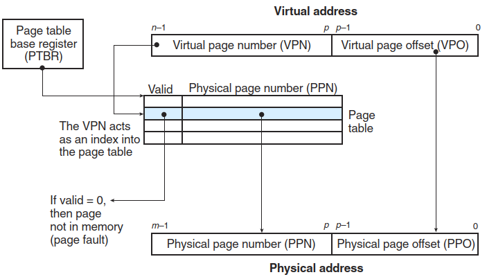

# Virtual memory
Conceptually, a virtual memory is organized as an array of N contiguous byte-size cells stored on disk. The contents of the array on disk are cached in main memory. At any point in time, the set of virtual pages is partitioned into three disjoint subsets:
- Unallocated
- Cached
- Uncached

Because of the large miss penalty and the expense of accessing the first byte, virtual pages tend to be large—typically 4 KB to 2 MB. Due to the large miss penalty, DRAM caches are fully associative; that is, any virtual page can be placed in any physical page. The replacement policy on misses also assumes greater importance, because the penalty associated with replacing the wrong virtual page is so high. Thus, operating systems use much more sophisticated replacement algorithms for DRAM caches than the hardware does for SRAM caches. Finally, because of the large access time of disk, DRAM caches always use write-back instead of write-through.[^csapp]

## Address translation

A page table is an array of page table entries (PTEs). Each page in the virtual address space has a PTE at a fixed offset in the page table.

### Translation lookaside buffer
Every time the CPU generates a virtual address, the MMU must refer to a PTE in order to translate the virtual address into a physical address. In the worst case, this requires an additional fetch from memory, at a cost of tens to hundreds of cycles. If the PTE happens to be cached in L1, then the cost goes down to a handful of cycles. However, many systems try to eliminate even this cost by including a small cache of PTEs in the MMU called a **translation lookaside buffer (TLB)**.[^csapp]

A TLB is a small, virtually addressed cache where each line holds a block consisting of a single PTE.

### Multi-level page tables
Accessing k PTEs may seem expensive and impractical at first glance. However, the TLB comes to the rescue here by caching PTEs from the page tables at the different levels. In practice, address translation with multi-level page tables is not significantly slower than with single-level page tables.[^csapp]

[^csapp]: Computer Systems：A Programmer's Perspective